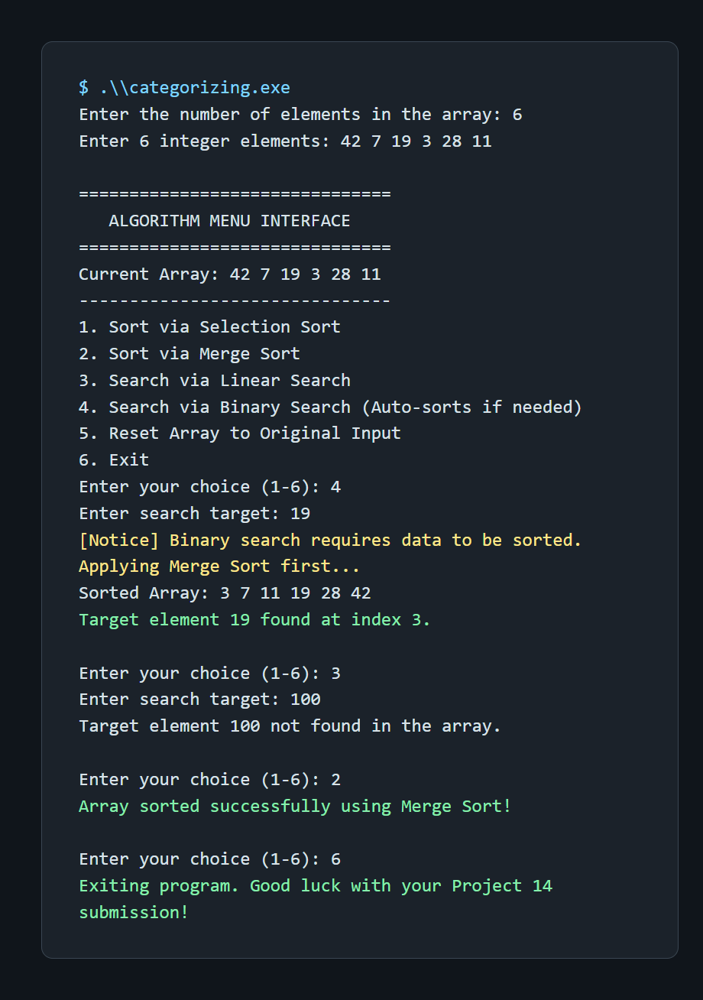

# Categorizing

An interactive C++ program that demonstrates common sorting and searching algorithms on an integer array.

## Features

- Selection sort
- Merge sort
- Linear search
- Binary search with automatic sorting when required
- Reset the array to its original input
- Interactive menu-driven interface

## Requirements

- A C++ compiler with C++17 support, such as `g++`

## Build and Run

```powershell
g++ index.cpp -std=c++17 -O2 -o categorizing.exe
.\categorizing.exe
```

On Linux or macOS:

```bash
g++ index.cpp -std=c++17 -O2 -o categorizing
./categorizing
```

Enter the array size and integer values when prompted, then choose an operation from the menu.

## Menu Options

| Option | Operation |
| --- | --- |
| 1 | Sort with selection sort |
| 2 | Sort with merge sort |
| 3 | Search with linear search |
| 4 | Search with binary search; the array is sorted automatically first if needed |
| 5 | Restore the original unsorted array |
| 6 | Exit |

## Algorithm Complexity

| Algorithm | Time complexity | Extra space |
| --- | --- | --- |
| Selection sort | $O(n^2)$ | $O(1)$ |
| Merge sort | $O(n \log n)$ | $O(n)$ |
| Linear search | $O(n)$ | $O(1)$ |
| Binary search | $O(\log n)$ | $O(1)$ |

## Example Output

The following screenshot shows binary search automatically sorting the input, a successful search, an unsuccessful search, and merge sort:



Example input:

```text
6
42 7 19 3 28 11
4
19
3
100
2
6
```

## Source

The implementation is contained in [index.cpp](index.cpp).