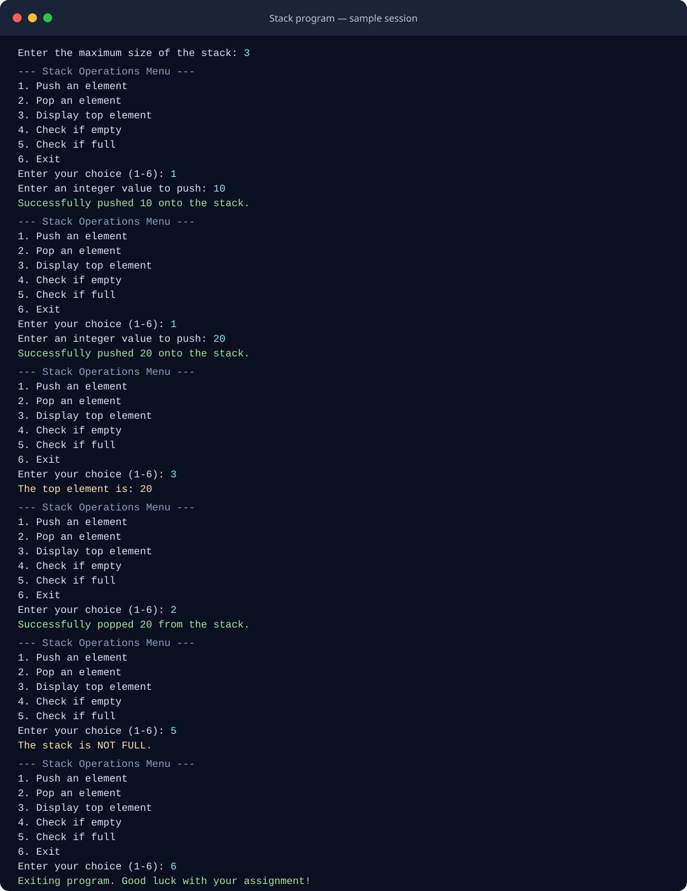

# Interactive Stack (C++)

A menu-driven integer stack implemented with a dynamically allocated array and a class template. The program demonstrates an abstract base class, inheritance, encapsulation, and basic stack operations.

## Features

- Push an integer onto the stack
- Pop the top integer
- View the top integer without removing it
- Check whether the stack is empty or full
- Report overflow and underflow attempts

## Requirements

- A C++ compiler with C++11 support or newer (for example, GCC/MinGW or Microsoft Visual C++)
- A terminal to run the interactive program

## Build and run

### GCC / MinGW (Windows PowerShell)

From the project directory:

```powershell
g++ -std=c++11 -Wall -Wextra -pedantic INDEX.CPP -o stack.exe
.\stack.exe
```

### GCC / MinGW (Linux or macOS)

```sh
g++ -std=c++11 -Wall -Wextra -pedantic INDEX.CPP -o stack
./stack
```

When prompted, enter a positive stack capacity, then select operations from the menu. Choose `6` to exit.

## Sample output

The screenshot below shows a sample session with a capacity of 3: two values are pushed, the top is displayed, one value is popped, and the stack status is checked.



## Source

The implementation is in [INDEX.CPP](INDEX.CPP).
