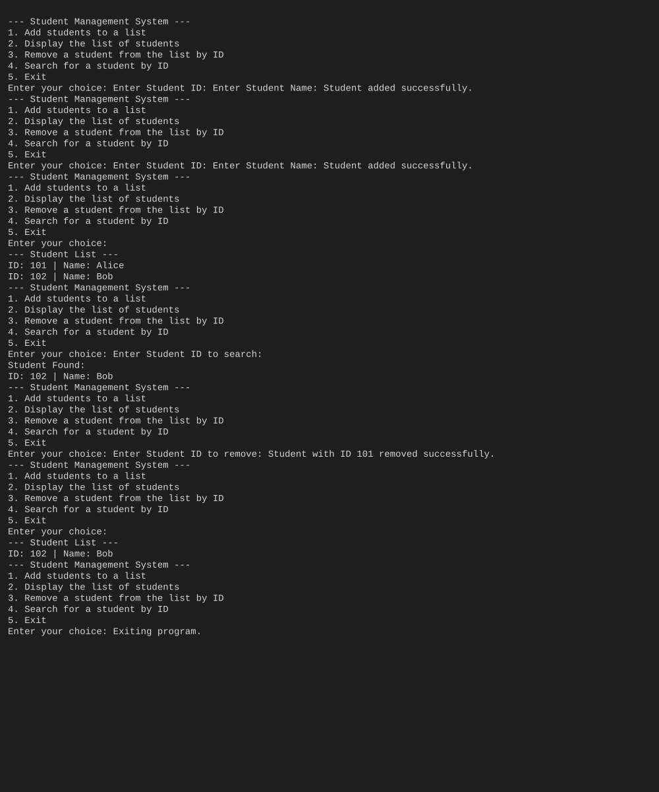

# Student Management (C++)

A small interactive CLI program demonstrating a templated class and simple in-memory student management (add, display, search, remove).

## Overview

This repository contains a single-file C++ program `memmory-calculator.c++` (misnamed) that implements a `MemoryCalculate<T>` template used here to store student `id` and `name` values inside a `std::vector` and provides a menu-driven interface.

Features:
- Add a student by ID and name
- Display all students
- Remove a student by ID
- Search for a student by ID

## Requirements

- A C++ compiler supporting C++11 or later (e.g., `g++`, MSVC).

## Build

Using `g++`:

```bash
g++ -std=c++11 -O2 -o memcalc "memmory-calculator.c++"
```

Using MSVC (Developer Command Prompt):

```powershell
cl /EHsc /O2 /Fe:memcalc.exe "memmory-calculator.c++"
```

## Run

Interactive run (Windows):

```powershell
.\memcalc
```

Or run with a prepared input file and capture output (Windows `cmd`):

```cmd
memcalc < sample_inputs.txt > program_output.txt
```

`sample_inputs.txt` is included as an example that exercises add/display/search/remove flows.

## Example Output (screenshot)

The following is a captured run of the program (sample inputs). It shows adding two students, listing them, searching, removing, and final listing.



## Files

- `memmory-calculator.c++` — main C++ source file (interactive menu).
- `sample_inputs.txt` — example input sequence for automated runs.
- `program_output.txt` — captured output from a sample run.
- `images/run_output.svg` — screenshot-like SVG of the sample run.

## Contributing

Suggestions and PRs welcome. If you rename the source file to a `.cpp` extension, update build commands accordingly.

## License

No license specified — add a `LICENSE` file to set terms.
