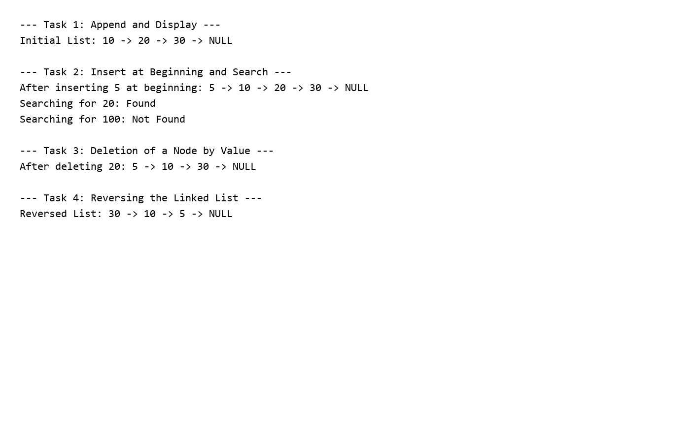

# Dynamic Memory Allocation in C++

This project demonstrates dynamic memory allocation and linked list operations in C++. It covers:

- Appending nodes to the list
- Inserting at the beginning
- Searching for a value
- Deleting a node by value
- Reversing the linked list
- Proper memory cleanup using the destructor

## Project File

- `dinamic-memmroy.c++`

## How to Run

1. Open a terminal in the project folder.
2. Compile the program:

```bash
g++ dinamic-memmroy.c++ -o dinamic-memmroy
```

3. Run the executable:

```bash
./dinamic-memmroy
```

On Windows PowerShell:

```powershell
g++ .\dinamic-memmroy.c++ -o .\dinamic-memmroy.exe
.\dinamic-memmroy.exe
```

## Sample Output



## Output Summary

The program displays operations for appending, inserting at the beginning, searching, deleting, and reversing a linked list.

Example output:

```text
--- Task 1: Append and Display ---
Initial List: 10 -> 20 -> 30 -> NULL

--- Task 2: Insert at Beginning and Search ---
After inserting 5 at beginning: 5 -> 10 -> 20 -> 30 -> NULL
Searching for 20: Found
Searching for 100: Not Found

--- Task 3: Deletion of a Node by Value ---
After deleting 20: 5 -> 10 -> 30 -> NULL

--- Task 4: Reversing the Linked List ---
Reversed List: 30 -> 10 -> 5 -> NULL
```

## Notes

This implementation uses a singly linked list and demonstrates safe dynamic memory management by deleting nodes in the destructor.
