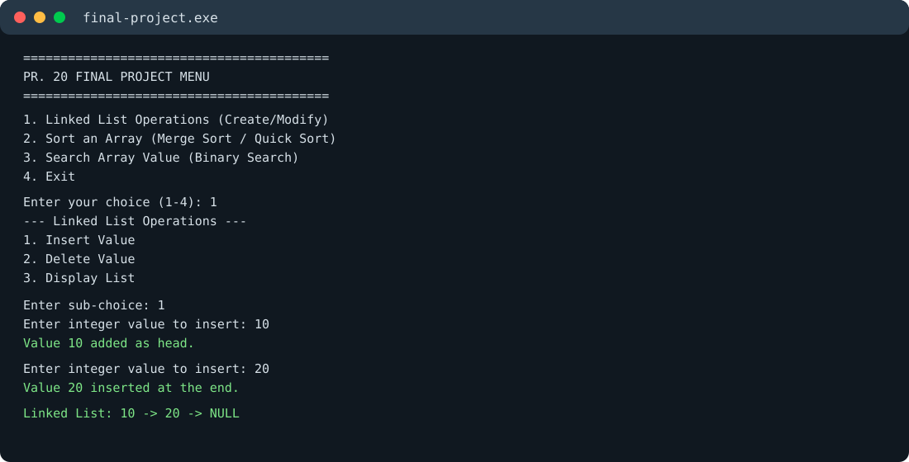
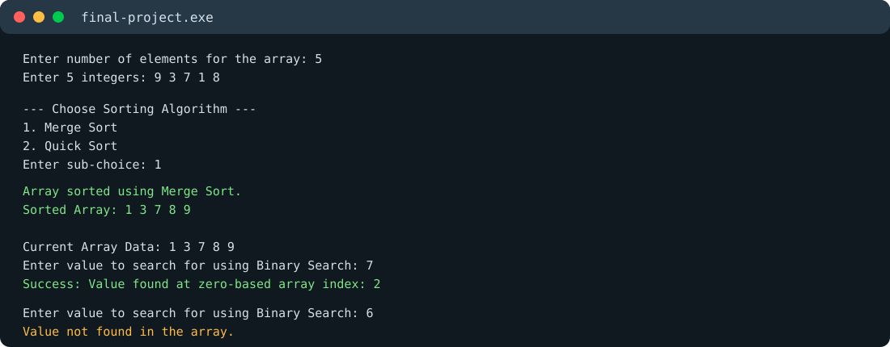

# PR. 20 Final Project

A menu-driven C++ application demonstrating fundamental data structures and algorithms.

## Features

- Linked list insertion, deletion, and display operations
- Merge sort
- Quick sort
- Binary search on a sorted array
- Interactive console menu

## Requirements

- A C++ compiler with C++17 support, such as `g++`
- Windows PowerShell, Command Prompt, or another terminal

## Build and Run

From the project directory:

```powershell
g++ index.cpp -std=c++17 -O2 -o .dist\final-project.exe
.dist\final-project.exe
```

On Linux or macOS:

```bash
g++ index.cpp -std=c++17 -O2 -o final-project
./final-project
```

Choose an option from the main menu, then follow the prompts. Option 2 sorts the array, and option 3 searches the sorted array using binary search.

## Sample Output

The screenshots below show a sample run using linked list operations, merge sort, and binary search.

### Linked List Operations



### Sorting and Searching



## Project Structure

```text
.
├── index.cpp
├── README.md
└── screenshots/
    ├── linked-list-output.svg
    └── sorting-searching-output.svg
```

## Algorithms

| Component | Operations | Typical complexity |
| --- | --- | --- |
| Linked list | Insert at end, delete by value, display | Insert: O(n), delete: O(n) |
| Merge sort | Sort an array | O(n log n) |
| Quick sort | Sort an array | Average: O(n log n) |
| Binary search | Find a value in sorted data | O(log n) |
